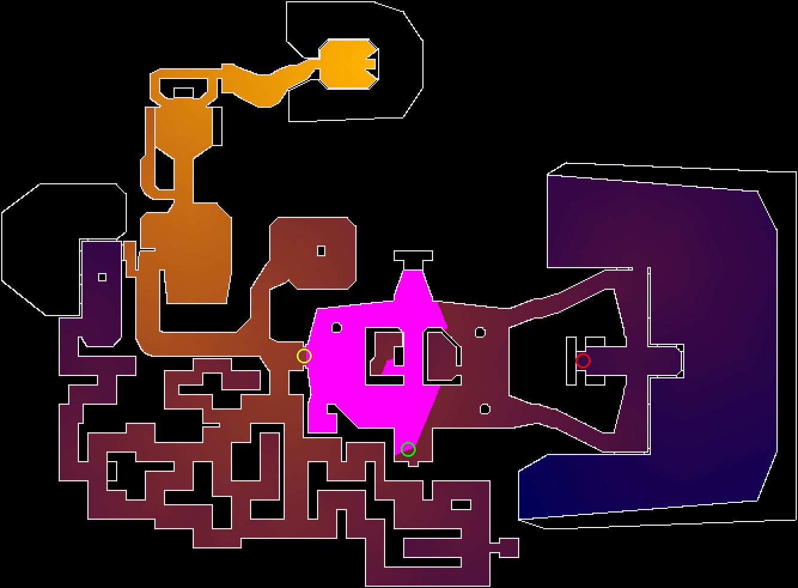

# M5 - Maps with keys

## Goal

Train a learned Driver that Clears `E1M2`, a Map whose route is not a straight walk to the exit, and measure what an exploration bonus adds by training with and without it. This is the step from "learn one route" to "find your way".

Written 2026-10-04, after M4. M4 showed that Progress shaping makes `E1M1` easy: three training seeds Cleared 15 of 15 in about 3 hours each. It also showed the limit: every Clear takes the same route, and the Progress meter treats locked doors as open (ADR 0008), so on a Map with keys it would pay the policy for walking toward a door it cannot yet open.

## Concepts the owner learns

- Exploration, and why a reward for "closer to the exit" fails when the way to the exit is a detour
- Intrinsic reward: Random Network Distillation (RND), a bonus for seeing something new
- Ablation: training with and without one ingredient, everything else equal, to measure what it adds
- Recurrent policies (LSTM), if remembering where the key was turns out to matter
- Reading a Map's structure: keys, locked doors, and which ones block the exit

## Starting state

- `MapEnv`, `ProgressShaping`, `PPOMapContender`, `doom-train --map`, the Map Scoreboard with training cost, `ProgressCurve`, intermediate checkpoints, `--init-from` and `--recurrent` (M4). Full 5M-step Training Runs averaged 440 to 456 steps per second with 8 copies, using 4.9 GB of WSL RAM.
- On `E1M1` (`e1m1-v1`): PPO with Progress shaping 15/15, Opus 5.5 H2 5/5, random 0/5.
- The Progress meter's distance field (`progress.py`) treats every door as open, locked ones included.
- A hobby PPO + RND + LSTM agent is reported to Clear `E1M2` in about 6M steps, 8 hours on an RTX 3080 (`research/2026-09-28-state-of-the-art-doom-agents.md`, R12).
- `sb3-contrib` has no RND; it would be written here or taken from a library (open fact 3).

## Steps

1. **Map `E1M2`'s route.** Which keys and doors stand between the start and the exit, and where Progress as defined today would mislead (open fact 1). Add an Eval Spec `e1m2-v1` (Difficulty 3, 5 seeds, a time limit chosen from the route's length) and measure random and the `E1M1` policies on it.
2. **Baseline: M4's recipe on `E1M2`.** Progress shaping alone, 5M steps. Watch where it gets stuck.
3. **Exploration bonus.** Add RND as an intrinsic reward and train with it, everything else equal: the ablation. Decide, when its first test is written, whether the bonus is a wrapper next to `ProgressShaping` or part of the training loop (open fact 3).
4. **Memory, if needed.** If failures show the policy forgetting where it has been, try `--recurrent`.
5. **Measure through the Eval Suite.** Both settings on `e1m2-v1`, 3 training seeds for the better one, videos, failure categories.
6. Draft Post 4 material and write the study guide.

## Constraints

- A Contender sees Human-equivalent Observations only (ADR 0002). Positions, keys held and the distance field may shape training reward or draw debugging curves; each use is declared in Results.
- Every result goes through the Eval Suite with seeds and cost; scored Attempts are not filmed tic by tic (ADR 0011).
- Training Runs are logged to W&B, with the Map's own reward and the Progress curve.
- Training seeds use spaced game seeds (`train.SEED_SPACING`), so each training seed's games are its own.
- Every result passes `docs/measurement-checklist.md` before it reaches the Scoreboard.

## Completion criteria

- [x] `E1M2`'s keys, locked doors and route are recorded, with where Progress misleads
- [ ] An Eval Spec for `E1M2` exists, with random and the `E1M1` policies measured on it
- [ ] M4's recipe and the exploration bonus are both trained on `E1M2` with the same settings otherwise, and both rows are on the Map Scoreboard
- [ ] The better setting is repeated with at least 3 training seeds
- [ ] Videos of a Clear (if any) and a failure exist, and every failed Attempt has a failure category
- [ ] Every privileged reward term is stated in Results
- [ ] `docs/learn/M5-maps-with-keys.md` exists
- [ ] Post 4 material is drafted in `docs/posts/04-maps-with-keys.md`
- [ ] The M6 brief is written

## Open facts to test

| # | Fact | Source of doubt |
|---|---|---|
| 1 | `E1M2` needs at least one key to reach the exit, and Progress as defined rewards walking toward a locked door | **(not verified)**: from memory of the Map, not checked against the WAD; ADR 0008 says locked doors count as open. **Confirmed 2026-10-07**, from the WAD: one key, the red keycard, and with the red door shut the exit is unreachable from the spawn. Progress as defined could not even measure `E1M2` (it read the lifts as walls, see Results); once it could, it paid up to 20.1% for reaching the red door without the key, and nothing for the detour to the key |
| 2 | The `E1M1` policies Clear nothing on `E1M2` | Expected, since they learned one route; not measured |
| 3 | RND can be added with a small amount of code on top of SB3's PPO, or comes from a maintained library | `sb3-contrib` 2.9 has no RND; CleanRL has `ppo_rnd_envpool.py` (research note); not checked against this project's setup |
| 4 | Steps and time a Clear of `E1M2` needs | R12 reports about 6M steps with RND and an LSTM; at M4's speed that is about 3.7 hours per training seed |
| 5 | A key-aware Progress (distance through the doors actually openable with the keys held) is computable from the WAD | The distance field already reads the WAD's lines; whether the lock type of each door is available there is not checked. **Answered 2026-10-07**: yes. Each door's lock is its line's action number (28 is "red key, opens and closes"), and the keys are things with their own types and positions. `progress.KeyedRoute` measures the route through the keys; which keys the player holds is read from ViZDoom's list of objects, since ViZDoom has no game variable for keys (ADR 0013) |

## Rough size

6 to 10 sessions, most of it waiting on Training Runs of 3 to 4 hours; open facts 1 and 3 decide the real number.

## Results

In progress. The notes below are in the order they were measured.

- **Progress could not measure `E1M2`** (found 2026-10-07). The meter read lifts and doors opened by a switch as walls, so the exit room, behind a lift (sector tag 13), was unreachable from the spawn: Progress came out as NaN. Lifts (line actions 62 and 88) and switch- or shot-opened doors (103 and 46) are now passable. The list is closed on purpose: adding action 63, which `E1M1` uses, would change `E1M1`'s field, and a test pins that field to the one every `E1M1` result was measured with.
- **`E1M2`'s keys, locked doors and route**, read from the WAD (`docs/milestones/make_figures_m5.py` draws both pictures):

  | What | Where (map units) | WAD |
  |---|---|---|
  | Spawn | (-32, -240), facing north | thing type 1 |
  | Red keycard, the Map's only key | (1136, 352), east of the spawn, at every Difficulty | thing type 13 |
  | Red door, the only way to the exit | about (-728, 384), west of the spawn | linedefs 527 and 528, action 28 |
  | Exit switch | (-256, 2304 to 2368), north-west | linedef 873, action 11 |
  | Lifts and remote doors on the route | | lifts on tags 1, 4, 10, 11, 13; switch doors on tags 5, 7, 12; a shot-opened door on tag 6 |

  With every door open, the walk from the spawn to the exit is 4,959 units. Through the red key it is 9,177: 2,222 east to the key, then 6,955 back west through the red door and north to the exit. The key lies farther from the exit than the spawn does.

  

  *Walking distance to the exit with every door open (bright = near), and the keyed route in cyan. Rings: spawn green, red key red, red door yellow.*

- **Where the doors-open rule misleads.** Before the red key, the doors-open rule pays for any ground closer to the exit than the spawn: the magenta area, which ends at the red door. There it has paid 20.1% of its Progress for a place the player cannot pass. The walk to the key pays nothing at all, since the key is 40% farther from the exit than the spawn, and after the key the rule pays again only once the player is back past the red door. A policy trained on it (M4's recipe) is paid to go to the door and stay there.

  

- **`e1m2-v1`**, chosen 2026-10-07 before any Attempt on it: `E1M2`, Difficulty 3, seeds 0 to 4, the `keyed` Progress rule, and a tic limit of 12,600 (6 minutes). `e1m1-v1` gives 6,300 tics to a 4,761-unit route, 1.32 tics per unit; the same allowance for `E1M2`'s 9,177-unit keyed route is 12,143 tics, rounded up to whole minutes. Six times the par time, which also gives `E1M1`'s limit, would have given 15,750 (par 75 s); the route length is the measure this project already uses. A learned Driver decides every 4 tics, so an Attempt has up to 3,150 decisions.
- **Keyed Progress** (`progress.KeyedRoute`, ADR 0013) measures the walk still to cover through the keys the player still needs, so on `E1M2` reaching the red key is worth 24.2% and standing at the red door without it is worth 0. On a Map without keys it equals the doors-open rule (tested on `E1M1`). Which keys the player holds comes from ViZDoom's list of objects: a picked-up key leaves the list (tested by walking into the red key), reading it costs no measurable speed, and it does not change the game (tested). The position and the keys held are Privileged Information, read for measuring only.
- **Random on `e1m2-v1`**: Clear Rate 0, Progress 2.3% (0.3% to 4.9% by seed), against 20% on `e1m1-v1`. It died in all five Attempts, after 668 to 3,336 tics: `E1M2` puts armed zombies near the spawn, where `E1M1` gave random three minutes of wandering. No Attempt picked up the red key.
