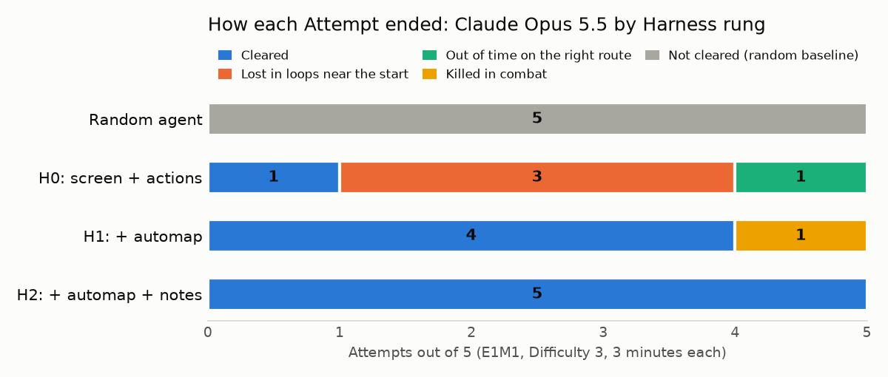
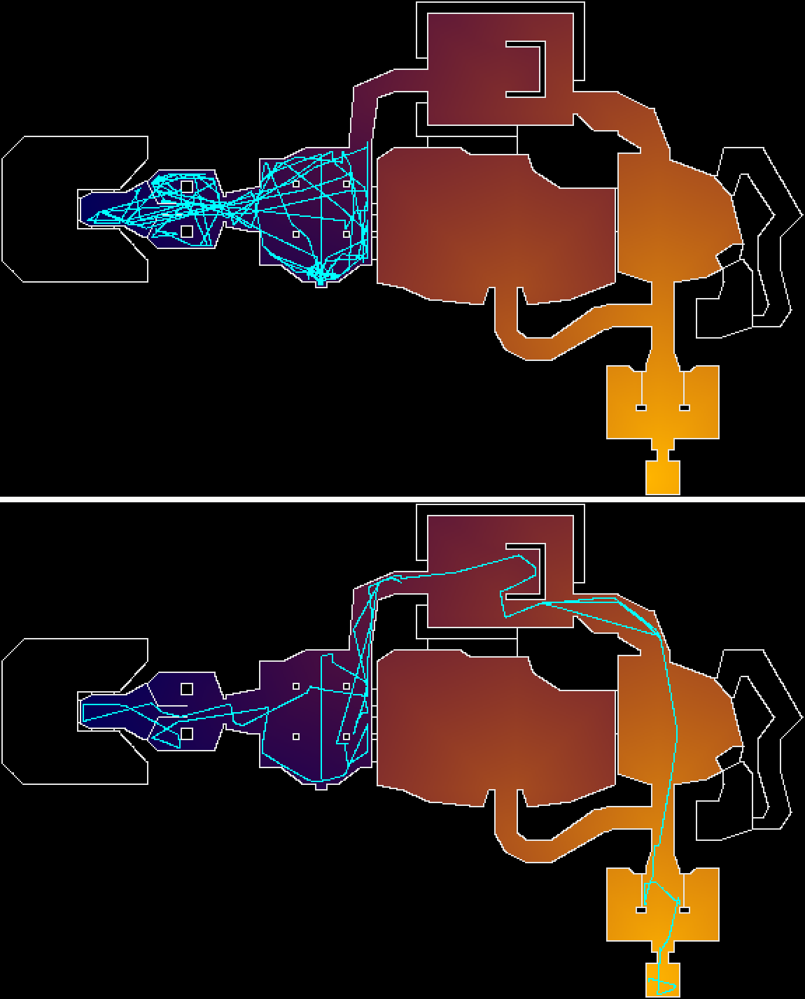

# Can an LLM finish the first level of Doom? (draft)

> Draft for the owner to edit and publish. Every number below comes from `results/` in this repository and was checked by replaying each Attempt from its transcript. Figures: `uv run python docs/posts/make_figures.py`.

In 2024, a paper asked GPT-4 to play the first level of the original Doom, E1M1 "Hangar". In none of its runs did it reach the exit; the best one made it to the final room and died ([de Wynter, 2024](https://arxiv.org/abs/2403.05468)). A 2025 benchmark scored every model at 0% on Doom II.

I tried again in October 2026 with Claude Opus 5.5. With nothing but the screen and the controls, it finished E1M1 once in five tries. With the automap, four in five. With the automap and a notebook, five in five.

## The setup

- **The game:** the original Doom (The Ultimate Doom WAD) running in ViZDoom. Map E1M1, Difficulty 3 ("Hurt Me Plenty"), 3 minutes of game time per Attempt, 5 fixed seeds.
- **What the model sees:** only what a human player sees. That means screenshots with the status bar, the HUD numbers, and the automap when it has it. It gets no coordinates, no map data, and no enemy positions.
- **How it plays:** through an MCP server with tools like `look` and `act(buttons, tics)`. The game pauses while the model thinks, so slow reasoning costs no game time. Claude Code runs headless and isolated: no file, shell or web tools, and no access to the code or the map files.
- **Three Harness rungs** (the same model each time, one more tool per rung):
  - **H0:** screen and actions
  - **H1:** H0 plus the automap
  - **H2:** H1 plus a notebook to write and reread notes

## Results

| Contender | Clear Rate | Progress | Tokens per Attempt | Wall-clock per Attempt |
|---|---|---|---|---|
| Random button presses | 0 / 5 | 20% | 0 | 2 s |
| Opus 5.5, H0: screen + actions | 1 / 5 | 48% | 24.4 M | 24 min |
| Opus 5.5, H1: + automap | 4 / 5 | 98% | 5.3 M | 7 min |
| Opus 5.5, H2: + automap + notes | 5 / 5 | 100% | 12.6 M | 12 min |

*Clear* means reaching the exit alive. *Progress* is how much of the walking route from spawn to exit the Attempt covered at its best moment, measured from the game's map data, which the model never sees.

Video of the fastest Clear (H1, seed 1, 43 seconds of game time): [`media/best-attempt.mp4`](media/best-attempt.mp4). All 15 videos are on [Weights & Biases](https://wandb.ai/luks-monteiro-13-my-own/doom-player/runs/5cf3kcr9).

## What went wrong, and what fixed it

Five Attempts failed, in three ways:

| How it failed | Count | Where |
|---|---|---|
| Lost in loops near the start: never found the corridor north | 3 | H0 |
| Out of time on the right route | 1 | H0 |
| Killed in combat near the exit | 1 | H1 |

Without the automap, the model mostly walks in circles. Below, the top path is an H0 Attempt: three minutes of loops through the start room and the wing behind it, which takes it *farther* from the exit. The bottom path is an H2 Attempt going straight to the exit switch.

The model's own words, mid-loop in H0: *"Everything here loops."* With the automap it stops guessing. The one H1 failure was a fight: it pushed into the room before the exit, traded shots with an imp, and died at 7 health, 89% of the way there.

## What this does and does not show

- **Five seeds is a small sample.** The difference between H1 (4/5) and H2 (5/5) is one Attempt. It cannot be told apart from chance. The jump from H0 to H1 is large, and the paths show why.
- **One Map, the easiest one.** E1M1 has no keys and little backtracking. Maps with locked doors are the real test of memory.
- **Not the same setup as the 2024 paper.** Here the game waits for the model, an action can last up to a second of game time, and H1/H2 add the automap. All of these make it easier than real-time play, and all are stated up front.
- **Cost is real.** H0 Attempts reread their whole history every turn: 24 M tokens for 3 minutes of play, almost all of it cache reads.

## Next

The same ruler now measures a small neural network trained by reinforcement learning: milliseconds per decision instead of seconds, and no language at all. Then the two get combined: a fast learned player steered by a slow LLM that reads the map.

Code, results and every transcript-backed number: [github.com/lucas-moont/doom-player](https://github.com/lucas-moont/doom-player)
