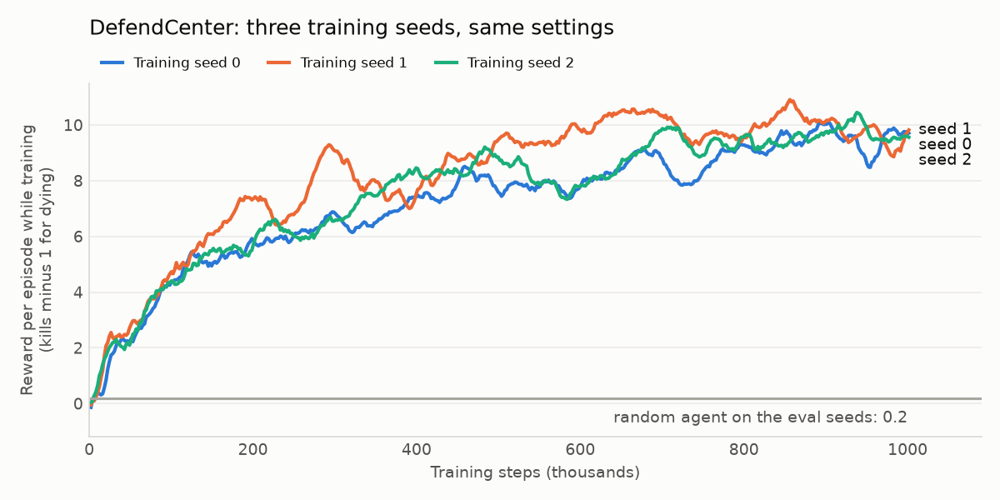
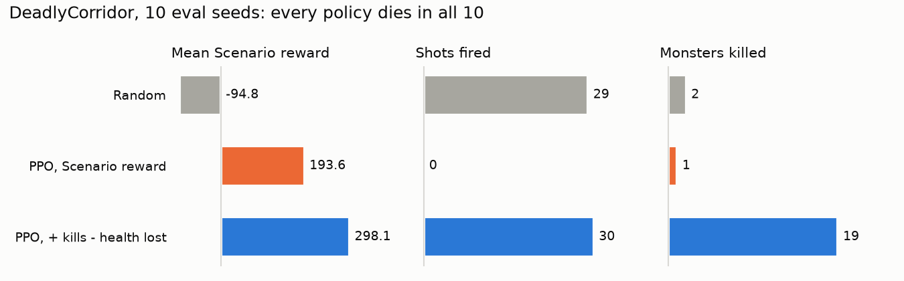

# A small network learns to shoot in Doom, then finds a loophole (draft)

> Draft for the owner to edit and publish. Every number below comes from `results/` in this repository, measured by the Eval Suite on fixed seeds. Figures: `uv run python docs/posts/make_figures_02.py`.

In the last post, Claude Opus 5.5 finished the first level of Doom by looking at screenshots and thinking: seconds per decision, millions of tokens per run. This time I went the other way. I trained a small neural network from scratch, by trial and error, on three ViZDoom training levels. No language. Each decision takes 0.7 milliseconds on the CPU, and nobody tells it what the buttons do.

It learned to aim, it learned to hold a room against monsters coming from every side, and on the hardest level it found a way to score points without playing the game I meant.

## The setup

- **The levels:** three of ViZDoom's Scenarios, small training maps with their own scoring.
  - **Basic:** one monster on the far wall. Shoot it fast.
  - **DefendCenter:** you stand in the middle of a circular room with limited ammo while monsters walk in from every side. +1 per kill, -1 for dying.
  - **DeadlyCorridor:** a corridor with armed guards on both sides, on Nightmare difficulty. The level pays you for the distance you cover toward the end of the corridor, and takes 100 if you die.
- **What the network sees:** the screen only, the way a player would: shrunk to 84x84, grayscale, the last 4 frames stacked so it can see motion. No health number, no position, no map.
- **How it learns:** PPO, a standard reinforcement learning method, from the Stable-Baselines3 library. The network plays 8 copies of the level at once, collects what happened, and nudges itself toward the actions that scored better. One million steps took 22 to 32 minutes on a laptop GPU (RTX 4050).
- **How it's measured:** the same Eval Suite as the LLM, with 10 fixed seeds per level. Every trained policy is compared with a random agent on those same seeds.

## Results

| Level | Random agent | Trained network | Training |
|---|---|---|---|
| Basic | -218.9 | 80.6 | 200k steps, 8 min |
| DefendCenter | 0.2 | 10.5 / 10.3 / 10.3 (three training seeds) | 1M steps, 22-25 min each |
| DeadlyCorridor | -94.8 | 298.1 (with an extra training reward, below) | 1M steps, 27 min |

Scores are each level's own reward, averaged over the 10 eval seeds.

## DefendCenter: the same result three times

A random agent kills 0 to 2 monsters before it dies. The trained network kills about 11. A clip is in [`media/defend-center.mp4`](media/defend-center.mp4).

One training run can be luck, so I trained it three times with different random starts (training seeds), with the settings unchanged. All three ended within 0.2 points of each other. They differ in *how fast* they got there: seed 1 was near +9 by 300k steps, while seeds 0 and 2 took until 700k to 900k.

All three still die in every Attempt, before the clock runs out. They have learned to shoot, not yet to survive.

## DeadlyCorridor: the loophole

The first network I trained on DeadlyCorridor beat the random agent by almost 300 points. Then I watched it.

It pressed one button, `MOVE_FORWARD`, on all 150 of its decisions. It never fired. It ran down the corridor past the guards and died, every time. And it was right to, given how it was being paid: the distance it covered before dying was worth more than the 100 points the level takes for dying. Clip: [`media/corridor-charge.mp4`](media/corridor-charge.mp4).

This is called *reward hacking*: the network finds what the score rewards, which is not always what the designer meant.

So I changed what it was paid during training, and only during training: +100 per kill, -1 per health point lost. The Eval Suite kept scoring the level's own reward, so the numbers stay comparable. The new network shoots the first pair of guards, walks on, and dies at the second pair. Clip: [`media/corridor-shaped.mp4`](media/corridor-shaped.mp4).

The middle panel is my favourite: the trained network fires about as often as the random agent (30 shots against 29), yet kills 19 guards against 2. It learned to aim.

One more try, with the health penalty five times heavier, changed nothing: same pattern, 18 kills, all 10 runs ending in death. The network still hasn't learned to survive the corridor.

## What this does and does not show

- **Three Scenarios are not Doom.** Each is a single small room or corridor built for training. The real levels have doors, keys, mazes, and a reward of 1 at the exit and 0 everywhere else.
- **One training seed on DeadlyCorridor.** The kill and shooting counts are clear-cut, but the gap between the two shaped versions (298 and 321) is smaller than the spread between eval seeds, so I count it as a tie.
- **The extra reward uses information the network never sees.** Kill counts, health, and in DeadlyCorridor even the level's own reward are read from the game engine. They decide what the network is paid while it trains. They are never part of what it sees.
- **The first Basic run collapsed.** With the library's default settings, the network learned the task and then lost it at around 85k steps: it stopped shooting and waited for the clock. Smaller, more cautious updates, as used for Atari games, fixed it. That run is kept in the repository too.

## Next

The next step is the original first level, E1M1, which the LLM finished in the last post. A network that sees only pixels will need the extra rewards this post started on, plus some memory of where it has been.

Code, results and every number above: [github.com/lucas-moont/doom-player](https://github.com/lucas-moont/doom-player)
