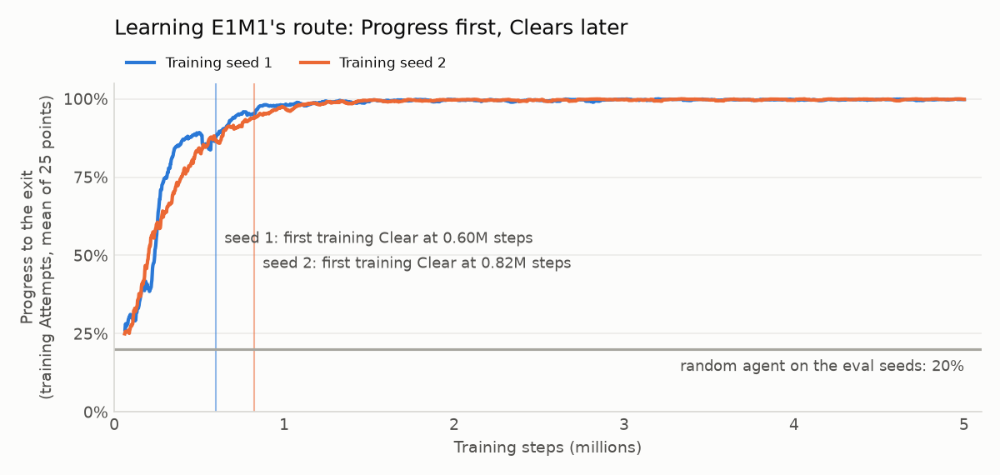
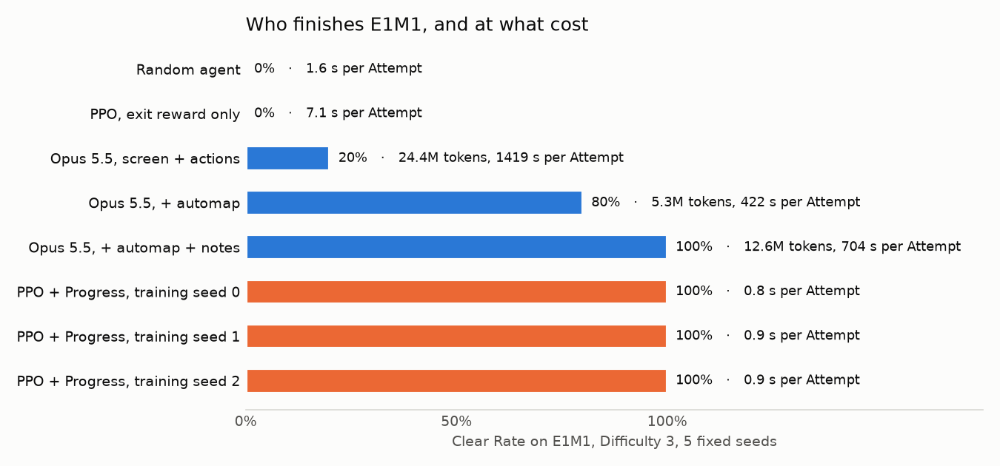

# A network that sees only the screen finishes Doom's first level (draft)

> Draft for the owner to edit and publish. Every number below comes from `results/` in this repository, measured by the same Eval Suite as Post 1. Figures: `uv run python docs/posts/make_figures_03.py`.

In the first post, Claude Opus 5.5 finished E1M1, the first level of the original Doom, in 5 of 5 tries, once it had the automap and a notebook. Each try cost 12.6 million tokens and 12 minutes.

This time a small neural network did it, trained from scratch by reinforcement learning on a laptop. It finished E1M1 in 15 of 15 tries, across three separate training runs. Each try takes about a second to compute (0.8 to 0.9 s on average) and 20 to 29 seconds of game time. It sees only the screen.

## The setup

- **The level:** E1M1 "Hangar" from The Ultimate Doom, at Difficulty 3, with 3 minutes per try and the same 5 fixed seeds as the LLM.
- **What the network sees:** the screen with its status bar, grayscale, shrunk to 84x84, the last 4 frames. No map, no coordinates, no health number other than what is drawn on the screen.
- **What it can press:** a short list of 11 button combinations (forward, turn, strafe, shoot, use, a few of these together). It can't switch weapons.
- **How it learns:** PPO from Stable-Baselines3, 8 copies of the game at once, 5 million steps per training run, about 3 hours on an RTX 4050 laptop GPU.
- **How it's measured:** the same referee as the LLM. In fact the network trains inside that referee, so it is measured on exactly the game it practised.

## The reward problem

Doom only says "well done" at the exit. A network that starts out pressing random buttons almost never gets there, so it has nothing to learn from. I trained one that way for a million steps. It walked to a corner of the first room and stared at a wall until the time ran out: 8.5% of the way to the exit, worse than random button presses (20%). Clip: [`media/e1m1-sparse.mp4`](media/e1m1-sparse.mp4).

So during training only, the network also gets points for new ground toward the exit, and loses some for dying: a Progress reward. "Toward the exit" is measured along the walking route, using the map's layout, which the network never sees. Only the best distance so far pays, so walking back and forth earns nothing. The referee still scores only whether it reaches the exit.

In the last post, a reward like this went wrong: paid for distance, a network learned to charge forward and die. Here it didn't. The network learned the route first, and how to survive to the end of it later:

## Results

| Contender | Finished | Cost per try |
|---|---|---|
| Random button presses | 0 / 5 | 1.6 s |
| PPO, exit reward only | 0 / 5 | 7 s |
| Opus 5.5, screen + actions | 1 / 5 | 24.4M tokens, 24 min |
| Opus 5.5, + automap | 4 / 5 | 5.3M tokens, 7 min |
| Opus 5.5, + automap + notes | 5 / 5 | 12.6M tokens, 12 min |
| PPO + Progress reward, 3 training runs | 15 / 15 | about 0.9 s each, after about 3 hours of training per run |

Every finish takes 20 to 29 seconds of game time; Opus's fastest took 43. Video of a finish: [`media/e1m1-clear.mp4`](media/e1m1-clear.mp4).

## What this does and does not show

- **It memorised one level.** All 15 finishes follow the same route, with nearly the same timing. Nothing here says the network could find its way through a level it hasn't trained on.
- **It runs past monsters instead of fighting.** In the videos it fires between 5 and 14 of its 50 bullets. That works on E1M1 at this difficulty. When the checkpoints saved halfway through training failed, they failed within a few percent of the exit.
- **E1M1 is the easy one.** No keys, little backtracking. The next levels need keys and memory of where you've been.
- **Training cost is real, just paid up front.** About 3 hours of a laptop GPU per run, against nothing for the LLM, which instead pays on every try.
- **I caught one measurement mistake along the way.** Recording video stepped the game one tic at a time, which redraws the face in the status bar differently. The network reads the whole screen, so it played slightly different games when filmed. Scored tries are now never filmed that way, and the videos are re-recorded to match them exactly.

## Next

E1M2, the second level, has a locked door. The key is somewhere else on the map, and walking distance to the exit says nothing about finding it. That needs a different kind of reward, and probably memory.

Code, results and every number above: [github.com/lucas-moont/doom-player](https://github.com/lucas-moont/doom-player)
