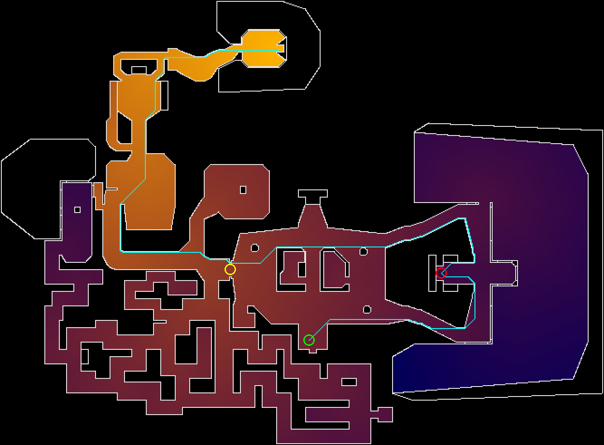
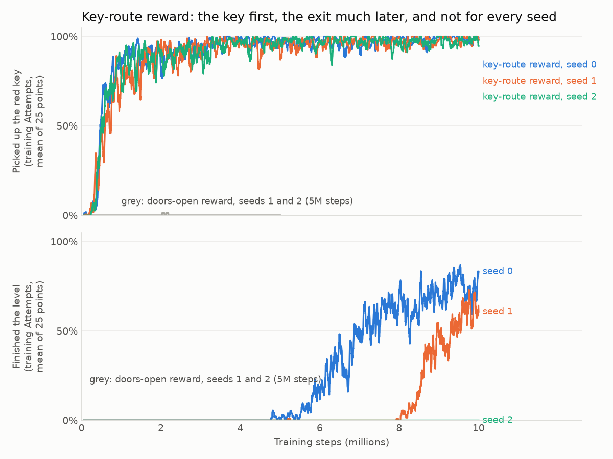
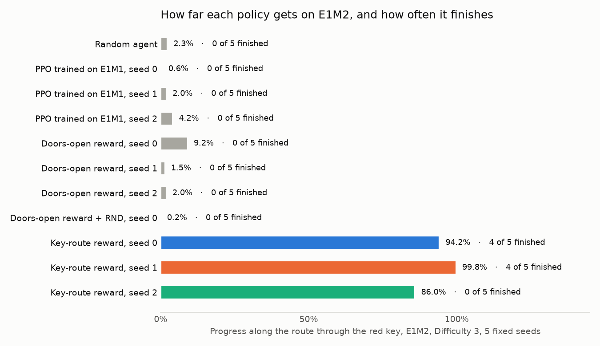

# The network went straight for the locked door (draft)

> Draft for the owner to edit and publish. Every number below comes from `results/` in this repository, measured by the same Eval Suite as Posts 1 to 3. Figures: `uv run python docs/posts/make_figures_04.py`.

In the last post, a small neural network that sees only the screen finished E1M1, the first level of the original Doom, in 15 of 15 tries. Its training reward paid it for getting closer to the exit.

E1M2, the second level, breaks that reward. The exit is behind a red door, and the red key sits on the far side of the map, farther from the exit than the starting point. Every network I trained with the E1M1 recipe walked straight to the locked door and stayed there.

Changing what the reward pays for, and nothing else, got it through: 8 finishes in 15 tries across three training runs. One of the three runs never finished at all.

## The setup

- **The level:** E1M2 "Nuclear Plant" from The Ultimate Doom, at Difficulty 3, with 6 minutes per try and 5 fixed seeds.
- **What the network sees:** the screen with its status bar, grayscale, 84x84, the last 4 frames. No map, no coordinates, no key indicator other than what is drawn on the screen.
- **How it learns:** PPO from Stable-Baselines3, 8 copies of the game at once, on an RTX 4050 laptop GPU.
- **How it's measured:** the same referee as every earlier post. A try counts as finished only if the player reaches the exit alive.

## The trap

The E1M1 reward is like a sat-nav that says "312 metres to go, 280, 250". It measures walking distance along the map, and to keep things simple it treats every door as open. On E1M2 that makes the locked red door look like a shortcut: standing in front of it is worth 20% of the way to the exit, and the walk to the key earns nothing, because the key is farther from the exit than the start.

*Walking distance to the exit (bright is near). Cyan: the route the level actually needs. Green: the start; red: the key; yellow: the red door.*

Three training runs with that reward, 5 million steps each (about 2.5 hours), finished 0 of 15 tries. In all 15 the network walked to the red door first. Clip: [`media/e1m2-red-door.mp4`](media/e1m2-red-door.mp4).

## The fix that didn't work

The textbook answer to "it never finds the key" is an exploration bonus: extra reward for seeing something new. I added one, Random Network Distillation (RND). It works like a flashcard quiz: one fixed network turns each screen into a set of numbers, a second network learns to guess them, and a bad guess means a new place, which pays.

With the bonus, everything else the same, the network did worse. It went into an alcove in the central room and stayed there until it was shot, in all five tries. Its progress fell to 0.2%, against 9.2% without the bonus. That was one training run per setting, so it doesn't prove RND can't help here. It does show that it didn't help with the bonus size I chose.

## The fix that did

The reward was the problem, so I changed the reward. The new one is a sat-nav that knows you must pick up a parcel first: the distance still to go counts the walk to the key, until you have it. Standing at the locked door without the key now earns nothing. Reaching the key earns about a quarter of the way.

Same network, same settings, same training seed. Within about a million steps the network was picking up the key in most of its training tries. Finishing took much longer:

| Training run | Reward | Finished at 5M steps | Finished at 10M steps |
|---|---|---|---|
| 3 runs | E1M1's, doors counted as open | 0 / 15 | not trained further |
| seed 0 | through the key | 0 / 5 | 4 / 5 |
| seed 1 | through the key | 0 / 5 | 4 / 5 |
| seed 2 | through the key | 0 / 5 | 0 / 5 |

Each finish takes 52 to 61 seconds of game time and about 2 seconds to compute. Training to 10 million steps took about 4.8 hours per run. Video of a finish: [`media/e1m2-clear.mp4`](media/e1m2-clear.mp4).

## What this does and does not show

- **The reward knew where the key was.** The network found nothing by itself: the reward was built from the level's layout, which I read out of the game files. The network still sees only the screen. But "the key matters, and this is where it is" came from me, not from the network.
- **One run in three never finished.** Past the red door, the route crosses an eight-sided room. Training seed 2's network enters it every time and circles it for one to four minutes, until something kills it. In one try it runs out of bullets and keeps circling, punching. Clip: [`media/e1m2-circling.mp4`](media/e1m2-circling.mp4). Why it does that, and whether more training would fix it, I haven't measured.
- **The score and the reward now overlap.** The new reward pays during training for the same progress the referee then measures, so the progress numbers flatter it. Finishing the level is the number to trust, and the referee checks that directly.
- **It memorised one level again.** All three networks trained on E1M2 alone. The E1M1 networks, tried on E1M2, barely differed from random button presses (0.6% to 4.2% of the way, against random's 2.3%).

## Next

Here the hint came as a hand-built reward. Next I'll try giving it as a recording instead: I play the level once, and the network learns from watching. The question is whether one human demonstration does the job that the hand-built reward did here, and whether it helps the run that got stuck.

Code, results and every number above: [github.com/lucas-moont/doom-player](https://github.com/lucas-moont/doom-player)
